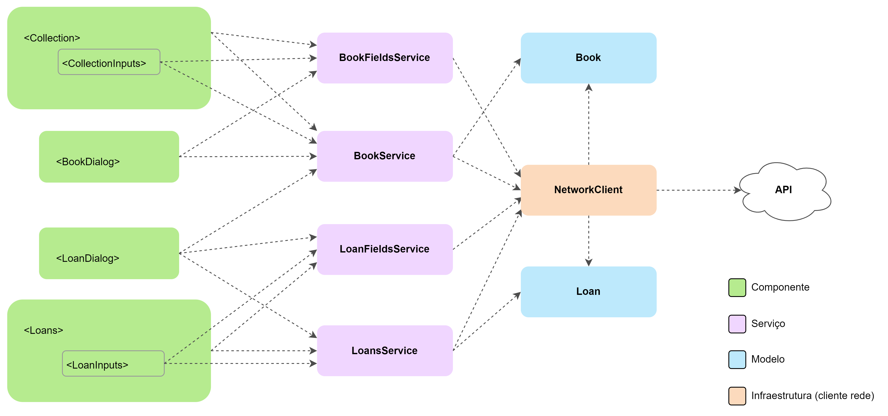

# Arquitetura (Angular)

A implementação do *frontend* baseada em Angular, assim como as demais, utiliza,
como base, a arquitetura proposta no artigo [Modularizing React Applications
with Established UI
Patterns](https://martinfowler.com/articles/modularizing-react-apps.html), mais
especificamente, o modelo *Layered Frontend Application*.Esse é o modelo que foi
utilizado como base para a arquitetura "comum" do *frontend* e que também foi
instanciado, com pequenas variações, nas demais implementações (baseadas em
React e Svelte). Assim como nas demais implementações, as camadas lógica e de
visualizações (*views*) definidas na [arquitetura
comum](../../docs/arquitetura.md) foram implementadas utilizando os recursos
fornecidos pelo *framework* Angular, com o cliente de rede e os modelos
(definidos na "camada comum") tendo sido reutilizados integralmente.

## Visão geral

O diagrama a seguir apresenta uma visão geral da arquitetura da implementação em
Angular, incluindo os componentes suas camadas (denotadas pelas cores) e a
relações de dependência (representadas por setas):

Assim como acontece nas implementações baseadas em outras ferramentas, a
arquitetura específica da implementação em Angular também é dividida em duas
camadas principais: a camada lógica (representada em roxo) — que tem, como
objetivos, realizar a conexão entre as camadas "genéricas" (i.e., os modelos e o
cliente de rede) e as camadas específicas da implementação em Angular, além de
implementar tarefas mais "genéricas" da interface — e a camada de visualizações,
composta pelas implementações dos componentes que formam os "blocos" utilizados
para a construção da interface gráfica.

Nessa implementação, a camada lógica é composta por
[serviços](https://angular.io/guide/architecture-services). Os serviços são um
tipo especial de classe que é utilizada pelo Angular para possibilitar o
encapsulamento e compartilhamento de lógica e dados entre diferentes
componentes, de forma similar aos *custom hooks* do React e às *custom stores*,
do Svelte. Porém, diferente dessas ferramentas, o Angular utiliza o padrão de
projeto injeção de dependências, passando uma instância da classe do serviço
diretamente a qualquer componente ou outro serviço por meio de um parâmetro,
declarado em seu construtor com o tipo do serviço a ser consumido. A instância
recebida pode ser uma referência a uma instância existente (global), uma nova
instância (local) ou pode ser obtida por meio de um método estático da classe do
serviço, utilizando o padrão fábrica.

A camada de visualizações (representada em verde), por sua vez, é composta por
três módulos do Angular, sendo estes compostos por um conjunto de componentes.
Um desses módulos é o de "páginas", composto por dois componentes que
implementam as duas páginas da aplicação, isto é, a página do acervo e a dos
empréstimos. Esse módulo depende dos outros dois módulos implementados, que são:
o módulo de "diálogos" e o módulo de "componentes". O módulo de "diálogos"
implementa as caixas de diálogo utilizadas na aplicação, nominalmente: o diálogo
para criação/edição de livros/empréstimos e o diálogo de status das operações
(utilizado para mostrar o progresso de uma operação e/ou reportar erros). Por
fim, o módulo de "componentes" contém implementações dos elementos "menores" e
reutilizáveis da interface (como botões, elementos de entrada de formulários,
caixas de texto, etc.), sendo consumido pelos módulos de "diálogos" e "páginas",
para a construção de seus componentes, que é feita a partir da composição desses
componentes reutilizáveis.

Os componentes, em Angular, assim como os serviços, são um tipo especial de
classe que é associada a um template HTML (markup) e a um conjunto de regras CSS
(estilos), responsáveis por definir a estrutura visual do componente
propriamente dita. O template HTML e os estilos CSS podem ser colocados em
arquivos separados, que são, então, associados à classe por meio do decorador
`@Component` — responsável por definir uma classe como um componente —, ou
escritos diretamente nesse decorador (*inline*). As variáveis e métodos de uma
classe definida como componente podem ser acessados no template HTML e são
reativas, isto é, se um valor de um campo é atualizado, o HTML correspondente ao
componente é atualizado de acordo. O Angular também disponibiliza uma sintaxe
especial para os templates HTML, permitindo lidar com aspectos como renderização
condicional e loops no *markup*, além de uma sintaxe que permite manipular
dinamicamente os estilos (CSS) de acordo com o valor de variáveis da classe.

As camadas mencionadas anteriormente bem como os módulos que as compõem e
algumas especificidades da implementação do *frontend* baseada no *framework*
Angular serão exploradas com detalhes nas seções seguintes.

## Camada lógica

De forma análoga às demais implementações, a camada lógica na implementação em
Angular atua como a fonte de dados do *frontend* e como uma espécie de
intermediário para as operações disponibilizadas pela aplicação por meio da API.
Essa camada é composta por quatro classes de serviços, isto é, classes que são
definidas utilizado o decorador `@Injectable` do Angular e que são acessadas
pelos componentes e por outros serviços que delas dependem utilizando a injeção
de dependências, conforme descrito anteriormente. Nessa implementação, apenas
uma instância (global) dessas classes é criada durante toda a execução da
aplicação, a fim de a manter o estado global e torná-lo acessível às diferentes
partes que a compõem. Essas classes de serviços são análogas aos *custom hooks*,
utilizados na implementação em React, e às *custom stores*, utilizadas na
implementação em Svelte, sendo também associadas às entidades da aplicação (i.e.
aos livros e aos empréstimos). Mais especificamente, foram implementados os
serviços `BooksService`, associado aos livros, e `LoansService`, associado aos
empréstimos, além dos serviços `BookFieldsService` e `LoanFieldsService`,
responsáveis por carregar e gerenciar os dados de todos os valores únicos de
alguns campos selecionados dos livros e empréstimos, respectivamente (como os
títulos de todos os livros no acervo ou o nome de todos os leitores com
empréstimos cadastrados no sistema). Esses dados são utilizados em alguns locais
específicos da interface, como os seletores dos filtros e os formulários de
criação de empréstimos (que lista os livros disponíveis) e de livros (que lista
as categorias de livros já cadastradas).

O serviços `BooksService` e `LoansService` possuem variáveis de classe que
armazenam as seguintes informações: os livros/empréstimos atualmente
selecionados, na forma de um vetor de objetos da classe do modelo
correspondente; o estado de carregamento das informações, que varia entre
"carregando", "carregado" ou "erro"; eventuais mensagens de erro encontradas
durante a comunicação com a API, além de uma variável de classe contendo os
últimos filtros aplicados e, no caso dos livros, a última chave de busca
utilizada, a fim de verificar se é realmente necessário realizar uma chamada à
API para carregar os dados dos livros/empréstimos, ou se as informações
cacheadas no vetor da classe estão atualizadas e podem ser retornadas
diretamente. Esses serviços também contém uma instância do cliente de rede,
utilizada para carregar os dados e realizar as operações na entidade que
representa, utilizando a API do *backend*. Além dessas variáveis privadas, os
serviços expõem métodos públicos assíncronos que implementam as operações do
CRUD para essas entidades, isto é, métodos que permitem: carregar os dados dos
livros/empréstimos, considerando os filtros aplicados (e, no caso dos livros,
também a chave de busca); criar um novo livro/empréstimo; atualizar um
livro/empréstimo e apagar um livro/empréstimo. Também são expostos *getters*
para o vetor contendo os livros, o status do carregamento e eventuais mensagens
de erro.

Os métodos carregamento dos livros/empréstimos (`fetchBooks` e `fetchLoans`,
respectivamente) recebem, como parâmetro, os filtros (e, no caso dos livros, a
chave de busca), e o carregamento é feito apenas quando se verifica que os
filtros e/ou chave de busca atuais são diferentes dos utilizados na última
chamada do método, que, inicialmente, são definidos como `undefined`, de modo
que essa comparação com o filtro inicial (que é um objeto vazio), é sempre
falsa, permitindo que todos os livros/empréstimos sejam carregados em um
primeiro momento. No caso em que é necessário fazer o carregamento (*fetch*) dos
livros, o status do objeto é atualizado para "carregando" (`"loading"`) e, na
sequência, é feita uma chamada para o método da API responsável por recuperar os
livros/empréstimos. Caso um erro ocorra durante esse processo, o status é
atualizado para "erro" (`"error"`), e a mensagem de erro da exceção encontrada é
colocada na variável da classe `errorMessage`. Por outro lado, se o carregamento
for feito com sucesso, o status é alterado para "carregado" (`"loaded"`). A
variável de status e a variável contendo a mensagem de erro são consumidas pelas
*views*, por meio dos *getters*, para dar um *feedback* visual do carregamento
e, eventualmente, exibir as mensagens de erro.

Os métodos para criar novos livros/empréstimos (`createBook` e `createLoan`,
respectivamente) recebem um objeto contendo os dados do formulário. Esse objeto
tem cada um de seus campos atrelado a um componente de entrada do formulário,
que utiliza a estratégia
[template-driven](https://angular.io/guide/forms-overview#setup-in-template-driven-forms)
para realizar a validação. A associação com os campos do objeto, por sua vez, é
feita por meio da propriedade especial
[`ngModel`](https://angular.io/api/forms/NgModel). Essa propriedade permite
vincular o valor de uma variável ao valor atual do componente do formulário
diretamente, utilizando o paradigma [*two-way
binding*](https://angular.io/guide/two-way-binding). Após uma submissão, se for
verificado que o fomulário se encontra em um estado válido, o método do serviço
para criação do novo livro/empréstimo é invocado. Nele, o objeto recebido do
formulário é convertido em uma instância da classe do modelo, utilizando o
método fábrica apropriado e, na sequência, é feita uma chamada à API, utilizando
o cliente de rede e fornecendo, como parâmetro, um objeto em formato apropriado,
obtido a partir da instância da classe do modelo por meio de uma chamada a outro
método dessa classe. Em caso de sucesso, o estado interno é atualizado para
conter o novo livro e, se ocorrer uma falha, é retornada a mensagem de erro da
exceção encontrada ou uma mensagem padrão. O chamador consegue, então, verificar
se a operação foi feita com sucesso a partir do valor de retorno do método, que
é vazio (`undefined`) em caso de sucesso.

Os métodos para atualizar livros/empréstimos (`updateBook` e `updateLoan`,
respectivamente) funcionam de forma análoga aos métodos utilizados para a
criação, com a principal diferença estando no fato de que o índice do livro a
ser atualizado no vetor do estado interno também é passado como parâmetro,
juntamente ao objeto contendo os dados do formulário. Para a atualização, o
método do cliente de rede chamado recebe, além do objeto correspondente ao corpo
da requisição — que é obtido da mesma forma que nos métodos de criação de
livros/empréstimos, descritos anteriormente —, o ID da entidade a ser
atualizada, que é obtido a partir da instância do modelo armazenada no vetor do
estado interno, no índice recebido como parâmetro. Em caso de sucesso na
operação, o vetor contendo os livros/empréstimos atualmente selecionados é
atualizado, com a nova instância do modelo — obtida a partir dos dados
atualizados, vindos do formulário — sendo atribuída ao índice-alvo, recebido
como parâmetro. Em caso de erro, é retornada uma mensagem de erro ao chamador,
da mesma forma que no método de criação, permitindo que este verifique se a
operação foi bem sucedida.

Os métodos para remover livros/empréstimos (`deleteBook` e `finishLoan`,
respectivamente), por sua vez, recebem apenas o índice da entidade a ser
removida no vetor do estado interno. A partir deste, é obtido o ID do
livro/empréstimo que se deseja remover e, na sequência, é feita uma chamada ao
método do cliente de rede que realiza essa operação, passando, como parâmetro,
esse ID. Em caso de sucesso, o vetor de livros/empréstimos selecionados é
atualizado, removendo o índice-alvo da operação, que foi recebido como
parâmetro. Eventuais erros são tratados da mesma forma que nos métodos para
criação e atualização de livros/empréstimos, detalhados anteriormente, ou seja,
uma string com a mensagem de erro é retornada caso alguma exceção seja
encontrada.

Por fim, os serviços `BookFieldsService` e `LoanFieldsService` funcionam de
forma bastante similar aos serviços explorados anteriormente, com a principal
diferença estando na ausência de métodos para criação, atualização e remoção de
entidades, uma vez que isso não se faz necessário nesse caso. Essas classes
armazenam um objeto cujas chaves correspondem aos campos dos livros/empréstimos,
para os quais os valores únicos são disponibilizados. Essas chaves mapeiam para
objetos compostos por um campo denominado `values`, que contém um vetor de
strings, responsável por armazenar os valores únicos do campo, além de um campo
`loadStatus`, indicando o status de carregamento desses valores, de forma
análoga ao que é feito nos serviços `BookService` e `LoanServices`. A classe
também conta com uma constante, calculada a partir desse objeto, que contém o
número de campos disponibilizados, e uma variável, que contém o número de campos
já carregados.

O carregamento é feito de forma similar, por meio do método `fetchFields`, que,
antes de fazer uma chamada à API, verifica se todos os campos foram carregados,
utilizando as variáveis de classe mencionadas anteriormente. Porém, como certas
mudanças no estado da aplicação feitas por outros serviços — como a criação ou
remoção de um livro/empréstimo, por exemplo — afetam os valores únicos dos
campos, também existe um método que permite "forçar" o recarregamento desses
dados. Esse método, denominado `refreshFields`, redefine o valor da variável
contendo a quantidade de campos carregados e invoca o método `fetchFields`,
efetivamente forçando um recarregamento desses valores. Esse método é invocado
sempre que alguma dessas operações é feita, pelo próprio serviço que a realizou,
ou seja, a invocação é feita pelos próprios métodos das classes `BookService` e
`LoanService` — que, consequentemente, dependem das classes `BookFieldsService`
e/ou `LoanFieldsService` —, causando uma atualização da lista de valores únicos
dos campos. O carregamento dos dados de cada campo é feito em paralelo e o
objeto contendo os valores e o status de carregamento é acessado por meio de um
*getter* cujo nome corresponde ao nome desse campo.

## Camada de visualizações

Na implementação em Angular, os componentes também seguem princípio do
isolamento da lógica do código das visualizações, defendido por Juntao QIU.
Sendo assim, vários dos componentes implementados se comportam como meros
templates HTML, ora sendo "preenchidos" a partir de valores passados como
propriedades, ora servindo apenas para encapsular os estilos (CSS) e a estrutura
de partes da interface (i.e., não possuindo nenhuma propriedade, estado ou
lógica). A maior parte da lógica da aplicação está contida nos serviços (ou
seja, na camada lógica, descrita anteriormente), sendo que os componentes, em
geral, não possuem estado ou implementam lógica relativa às regras de negócio da
aplicação, utilizando, para tanto, os serviços. Alguns componentes, porém,
possuem uma lógica própria mais complexa (como as caixas de diálogo e o
componente seletor dos formulários, por exemplo) e, portanto, contêm lógica e/ou
estado próprio, o que, nessa situação, é até benéfico, uma vez que permite
encapsular a lógica e as variáveis de estado do componente, separando-os do
fluxo de dados principal da aplicação e mantendo-os próximo ao código da
visualização, tornando mais fácil a manutenção do componente.

Diferente do React, o fluxo de dados no Angular pode ocorrer nos dois sentidos,
isto é, podemos ter dados fluindo de um componente pai para um componente filho
e vice-versa (o chamado *two-way data binding*). Isso facilita bastante a
implementação de partes da lógica da aplicação, especialmente dos formulários,
na medida em que dispensa o uso de *callbacks* — isto é, funções passadas como
parâmetro aos componentes — para lidar com eventos de atualização de certos
valores, permitindo vincular variáveis a propriedades de componentes, de modo
que estas são atualizadas implicitamente quando os valores dessas propriedades
mudam. Além disso, o sistema de injeção de dependências facilita o acesso à
camada lógica (serviços), de modo que, na arquitetura dessa implementação,
alguns componentes de nível mais baixo na hierarquia também a acessam
diretamente, diferentemente da implementação em React, na qual esse acesso
estava restrito aos componentes de mais alto nível da hierarquia e os
componentes "inferiores" acessavam as informações apenas por meio de
propriedades. A injeção de dependências permite expressar melhor as relações de
dependência entre os componentes e a camada lógica, na medida em que os dados e
operações dos serviços são acessados diretamente onde são necessários ao invés
de serem repassados como parâmetro ao longo da hierarquia ou acessados a partir
de APIs de contexto, que tendem a tornar essas dependências mais "obscuras".
Outra consequência positiva da injeção de dependências está no fato de que os
componentes de mais alto nível (nesse caso, as páginas) acabam ficando menores
em comparação, o que facilita bastante a sua compreensão e, consequentemente, a
sua manutenção.
