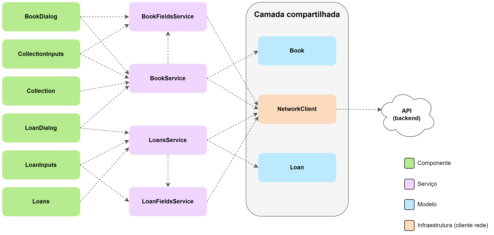

# Arquitetura (Angular)

A implementação do *frontend* baseada em Angular usa como base as ideias
propostas no artigo [Modularizing React Applications with Established UI
Patterns](https://martinfowler.com/articles/modularizing-react-apps.html),
utilizado como base para a arquitetura "comum" e para a implementação baseada em
React. Assim como nas demais implementações, as camadas lógica e de
visualizações (*views*) definidas na [arquitetura
comum](https://github.com/PedroPires20/SimpleLibrary-Frontend/docs/arquitetura.md)
foram implementadas utilizando os recursos fornecidos pelo *framework* Angular.

## Visão geral

O diagrama a seguir apresenta uma visão geral da arquitetura da implementação em
Angular, incluindo os componentes suas camadas (denotadas pelas cores) e a
relações de dependência (representadas por setas):

Conforme definido anteriormente, a camada lógica (representada em roxo) tem,
como objetivos, realizar a conexão entre as camadas "genéricas" (i.e., os
modelos e o cliente de rede) e as camadas específicas de cada implementação
(nesse caso, da implementação em Angular), além de implementar tarefas mais
"genéricas" da interface — como o carregamento de dados, tratamento de eventos
de "mais alto nível" (como a submissão de um formulário) e gerenciamento do
estado global do *frontend*.

Nessa implementação, a camada lógica é composta por
[serviços](https://angular.io/guide/architecture-services). Os serviços são um
tipo especial de classe que é utilizada pelo Angular para possibilitar o
encapsulamento compartilhamento de lógica (e dados) entre diferentes
componentes, de forma similar aos [*custom
hooks*](https://react.dev/learn/reusing-logic-with-custom-hooks) do React. Para
tanto, o *framework* utiliza o padrão de projeto injeção de de dependências,
passando uma instância da classe do serviço diretamente como parâmetro a
qualquer componente ou serviço que declare um parâmetro desse tipo em seu
construtor. A instância passada pode ser uma instância existente (global), uma
nova instância ou pode ser obtida por meio de um método estático (fábrica) da
classe.

Por outro lado, a camada de visualizações (representada em verde), é composta
por três módulos do Angular, que, por sua vez, são compostos por componentes. Um
desses módulos é o de "páginas", composto por dois componentes que implementam
as duas páginas da aplicação, isto é, a página do acervo e a dos empréstimos.
Esse módulo depende dos outros dois módulos implementados que são: o módulo de
"diálogos" e o módulo de "componentes". O módulo de "diálogos" implementa as
caixas de diálogo utilizadas na aplicação, nominalmente: o diálogo para
criação/edição de livros/empréstimos e o diálogo de status das operações
(utilizado para mostrar o progresso de uma operação e/ou reportar erros). Por
fim, o módulo de "componentes" contém implementações dos elementos "menores" da
interface (como botões, elementos de entrada de formulários, caixas de texto,
etc.), sendo utilizado pelos módulos de "diálogos" e "páginas" para construção
de seus componentes (feitas pela composição desses elementos "menores").

Os componentes, em Angular, assim como os serviços, são um tipo especial de
classe, associada a um arquivo de template HTML (markup) e um arquivo CSS
(estilos), que definem a estrutura visual do componente, propriamente dita. Os
campos e métodos dessa classe podem ser acessados no HTML e são reativos — isto
é, se um valor de um campo é atualizado, o HTML correspondente ao componente é
atualizado de acordo. O Angular também disponibiliza uma sintaxe para lidar com
renderização condicional e loops nos templates HTML, além de uma sintaxe para
atualizar dinamicamente os estilos (CSS) de acordo com o valor de uma variável
de classe.

As camadas mencionadas anteriormente bem como os módulos que as compõem e
algumas especificidades da implementação do *frontend* baseada no *framework*
Angular serão exploradas com detalhes nas seções seguintes.

## Camada lógica

De forma análoga à camada homônima na implementação em React, a camada lógica,
na implementação em Angular, atua como a fonte de dados do *frontend* e como uma
espécie de intermediário para as operações disponibilizadas pela aplicação por
meio da API. Essa camada é composta por quatro classes de serviços — isto é,
classes que usam o decorador `@Injectable` do Angular — e que são acessadas
pelos componentes que dependem delas via injeção de dependências, conforme
descrito anteriormente. Nesse caso, apenas uma instância (global) dessas classes
é criada, sendo utilizada para manter um estado "global" da aplicação e torná-lo
acessível em diferentes partes da aplicação. Essas classes de serviços são
análogas aos *custom hooks* da implementação em React, sendo um serviço
associado a cada entidade a aplicação, com o serviço `BooksService` associado
aos livros, e, o serviço `LoansService`, associado aos empréstimos. Além desses,
foram implementados outros dois serviços (`BookFieldsService` e
`LoanFieldsService`), responsáveis por carregar e gerenciar os dados de todos os
valores únicos de alguns campos selecionados dos livros/empréstimos (como os
títulos de todos os livros no acervo ou o nome de todos os leitores com
empréstimos cadastrados no sistema). Esses dados são utilizados em alguns locais
específicos da interface, como os seletores dos filtros e os formulários de
criação de empréstimos (que lista os livros disponíveis) e de livros (que lista
as categorias de livros já cadastradas).

O serviços `BooksService` e `LoansService` possuem variáveis de classe que
contém: o estado dos livros/empréstimos (na forma de um vetor de objetos da
classe do modelo correspondente); o estado de carregamento — que varia entre
carregando, carregado ou erro —; eventuais mensagens de erro no carregamento,
além de uma variável de classe contendo os últimos filtros e, no caso dos
livros, a última chave de busca utilizada, utilizadas para verificar se é
necessário recarregar os dados dos livros/empréstimos, ou se as informações
cacheadas no vetor da classe estão atualizadas e podem ser retornadas
diretamente. Esses serviços também estão associados a uma instância do cliente
de rede, utilizada para carregar os dados e realizar as operações na entidade
que representa, via API. Além dessas variáveis, são expostos métodos assíncronos
para carregar os dados de todos os livros/empréstimos, criar um novo
livro/empréstimo, atualizar um livro/empréstimo e apagar um livro/empréstimo
(implementando as operações do CRUD para essas entidades). Também são expostos
*getters* para o vetor contendo os livros, a mensagem de status do carregamento
e (eventuais) mensagens de erro.

Os métodos carregamento dos livros/empréstimos recebem, como parâmetro, os
filtros (e, no caso dos livros, a chave de busca), e o carregamento é feito
apenas quando se verifica que os filtros (e/ou chave de busca, no caso dos
livros) atuais são diferentes do último filtro utilizado — que, inicialmente, é
`undefined`, de modo que essa comparação com o filtro inicial (que é um objeto
vazio), é sempre verdadeira. No caso em que é necessário fazer o carregamento
(*fetch*) dos livros, o status do objeto é atualizado para "carregando"
(`"loading"`) e, na sequência, é feita uma chamada para o método da API
responsável por recuperar os livros/empréstimos. Caso um erro ocorra durante
esse processo, o status é atualizado para "erro" (`"error"`), e a mensagem de
erro da exceção encontrada é colocada na variável da classe `errorMessage`. Por
outro lado, se o carregamento for feito com sucesso, o status é alterado para
"carregado" (`"loaded"`). A variável de status e a variável contendo a mensagem
de erro são consumidas, pelas *views* (por meio dos *getters*) para dar um
*feedback* visual do carregamento e, eventualmente, mostrar mensagens de erro.

Os métodos para criar novos livros/empréstimos, recebem um objeto contendo os
dados do formulário. Esse objeto tem cada um de seus campos atrelado a um
componente de entrada do formulário, que utiliza a estratégia
[template-driven](https://angular.io/guide/forms-overview#setup-in-template-driven-forms)
para a validação, por meio da propriedade especial
[`ngModel`](https://angular.io/api/core/NgModule). Essa propriedade permite
atrelar o valor da variável ao valor do componente do formulário diretamente,
utilizando a estratégia [*two-way
binding*](https://angular.io/guide/two-way-binding). Ao ser submetido, se for
verificado que o fomulário se encontra em um estado válido, o método do serviço
para criação do novo livro/empréstimo é invocado. Nele, o objeto recebido do
formulário é convertido em um modelo, utilizando um método fábrica apropriado e,
na sequência, é feita uma chamada à API, utilizando um objeto em formato
apropriado, obtido a partir de um método da classe modelo. Em caso de sucesso, o
estado interno é atualizado para conter o novo livro e, se ocorrer uma falha, é
retornada a mensagem de erro da exceção encontrada ou uma mensagem padrão. O
chamador consegue, então, verificar se a operação foi feita com sucesso
verificando se a função retornou algum valor. O método para atualizar
livros/empréstimos funciona de forma análoga, com a diferença de que o índice do
livro a ser atualizado (no vetor do estado interno) também é passado como
parâmetro e que o método do cliente de rede chamado é o responsável por
atualizar um livro/empréstimo, recebendo, também, o ID da entidade a ser
atualizada (obtido a partir do estado interno). O método para remover
livros/empréstimos, por sua vez, recebe apenas o índice da entidade a ser
removida no vetor do estado interno e apenas faz uma chamada ao método do
cliente de rede que realiza essa operação, obtendo o ID do livro/empréstimo
diretamente do estado interno e tratando os erros da mesma forma que nos métodos
para criação e atualização (i.e. retornado uma string com a mensagem de erro,
caso alguma exceção seja encontrada).

Por fim, os serviços `BookFieldsService` e `LoanFieldsService` funcionam de
forma bastante similar aos serviços explorados anteriormente, com a principal
diferença sendo a ausência de métodos para criação, atualização e remoção de
entidades, uma vez que isso não se faz necessário nesse caso. Essa classe
armazena um objeto cujas chaves correspondem aos campos cujos valores únicos são
disponibilizados e os valores são vetores de strings que correspondem a tais
valores únicos. A classe também conta com uma constante, calculada a partir
desse objeto, que contém o número de campos disponibilizados e uma variável, que
contém o número de campos já carregados. O carregamento é feito de forma
similar, por meio de um método que, antes de fazer uma chamada à API, verifica
se todos os campos foram carregados (utilizando as variáveis mencionadas
anteriormente). Porém, como mudanças na aplicação feitas por outros serviços
(como a criação ou remoção de um livro/empréstimo) afetam os valores desses
campos, também existe um método que redefine o valor da variável contendo a
quantidade de campos carregados, efetivamente forçando um recarregamento desses
valores. Esse método é invocado quando alguma dessas operações é feita, causando
uma atualização da lista de valores únicos dos campos. O carregamento dos campos
é feito em paralelo e, para cada campo, existe uma variável de status análoga à
dos serviços `BookService` e `LoansServices`, descritos anteriormente. Cada
campo fica acessível diretamente por meio de um *getter* cujo nome corresponde
ao nome desse campo.

## Camada de visualizações

Assim como na implementação em React, os componentes implementados também seguem
princípio do isolamento da lógica do restante da implementação defendido por
Juntao QIU, em seu artigo. Sendo assim, vários dos componentes implementados se
comportam como meros templates HTML, ora sendo "preenchidos" a partir de valores
passados como propriedades ora servindo apenas para encapsular os estilos (CSS)
e estrutura de partes da interface (i.e. não implementando nenhuma lógica). Boa
parte da lógica da aplicação está contida nos serviços (ou seja, na camada
lógica, descrita anteriormente), sendo que os componentes, em geral, não possuem
estado ou implementam lógica relativa às regras de negócio da aplicação,
utilizando, para tanto, os serviços. Alguns componentes, porém, possuem uma
lógica própria mais complexa — para abrir uma caixa de diálogo ou controlar o
preenchimento e validação de um formulário, por exemplo — e, nesses casos, podem
conter lógica e/ou estado próprio, o que, nessa situação, é benéfico, uma vez
que se encapsula lógica/dados de parte da aplicação que não fazem parte do fluxo
de dados principal.

Diferente do React, o fluxo de dados no Angular ocorre nos dois sentidos, isto
é, podemos ter dados fluindo de um componente pai para um componente filho e
vice-versa (o chamado *two-way data binding*). Isso facilita a implementação de
partes da lógica da aplicação, dispensando o uso de *callbacks* — isto é,
funções passadas como parâmetro aos componentes — para lidar com eventos e a
associação de variáveis a componentes de entrada dos formulários, por exemplo.
Além disso, o sistema de injeção de dependências facilita o acesso à camada
lógica (serviços), de modo que, na arquitetura dessa implementação, alguns
componentes de nível "intermediário" também a acessam — diferentemente da
implementação em React, na qual esse acesso estava restrito aos componentes de
mais alto nível da hierarquia — possibilitando expressar melhor as dependências
de componentes com a camada lógica na medida em que os dados e operações dos
serviços são acessados diretamente onde são necessários ao invés de serem
repassados diversas vezes como parâmetros pela hierarquia. Isso permite com que
os componentes de mais alto nível (isto é, as páginas) sejam menores em
comparação, facilitando sua manutenção.
