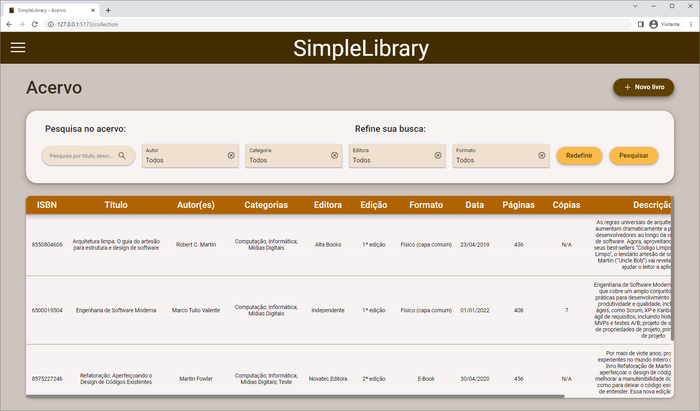
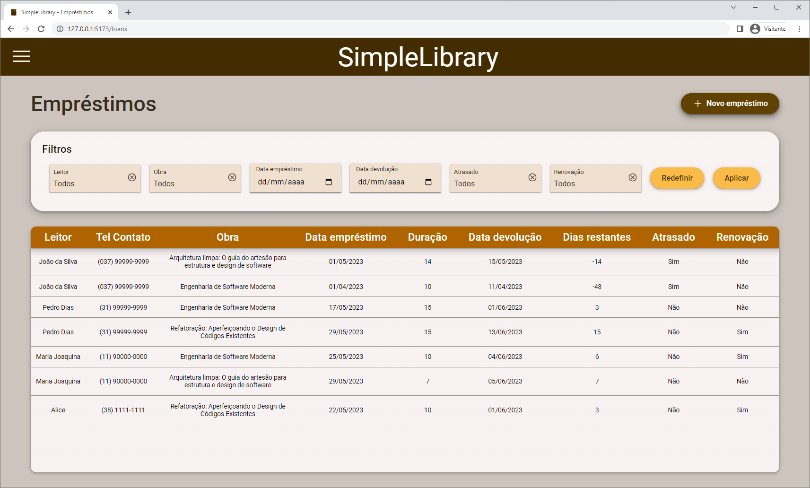
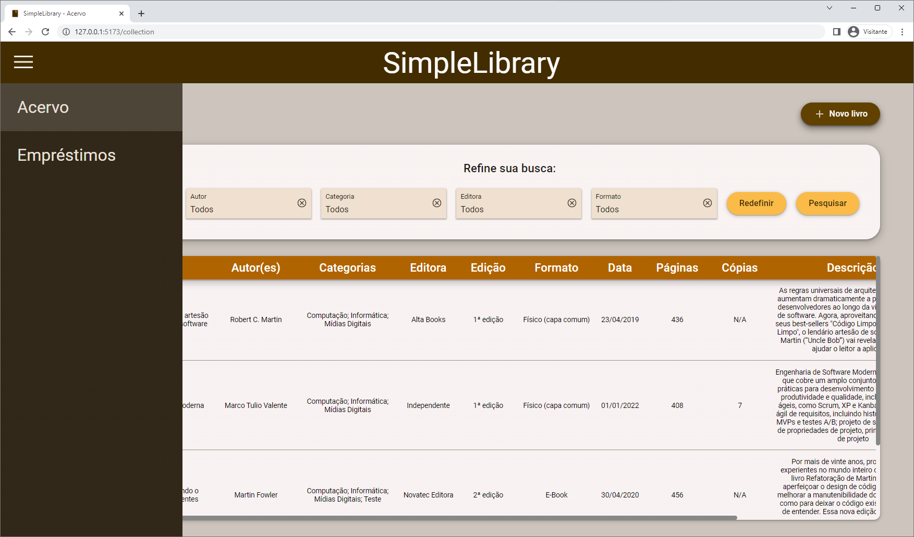
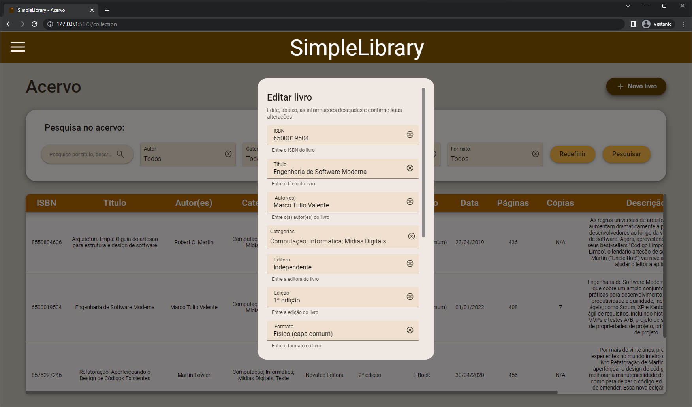
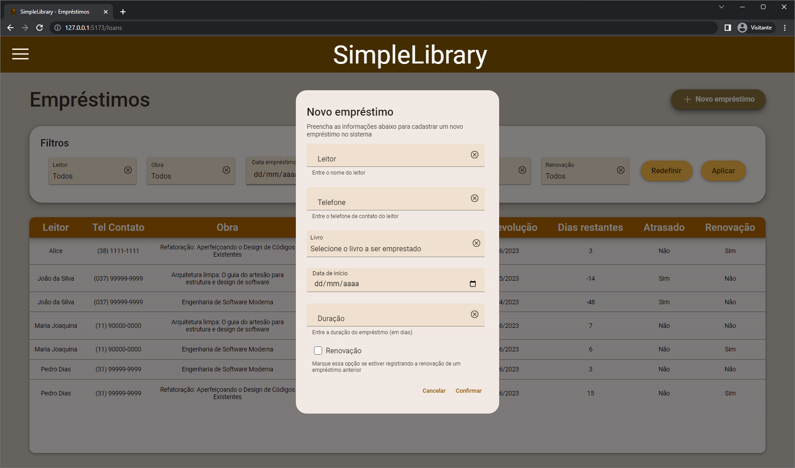
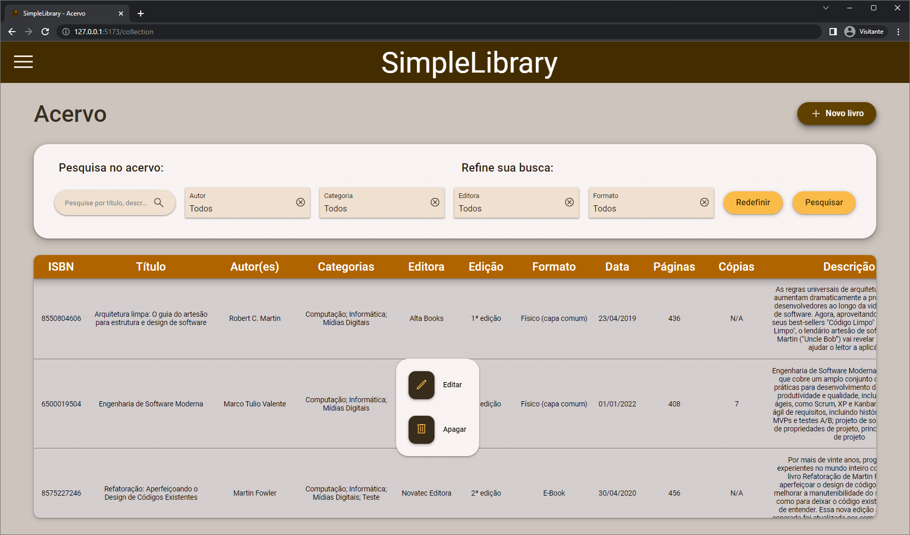
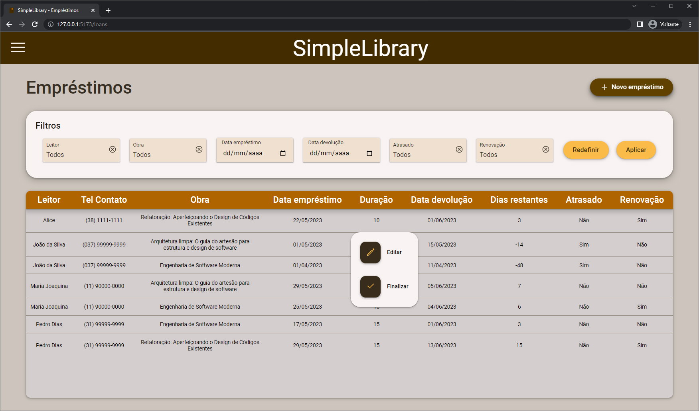
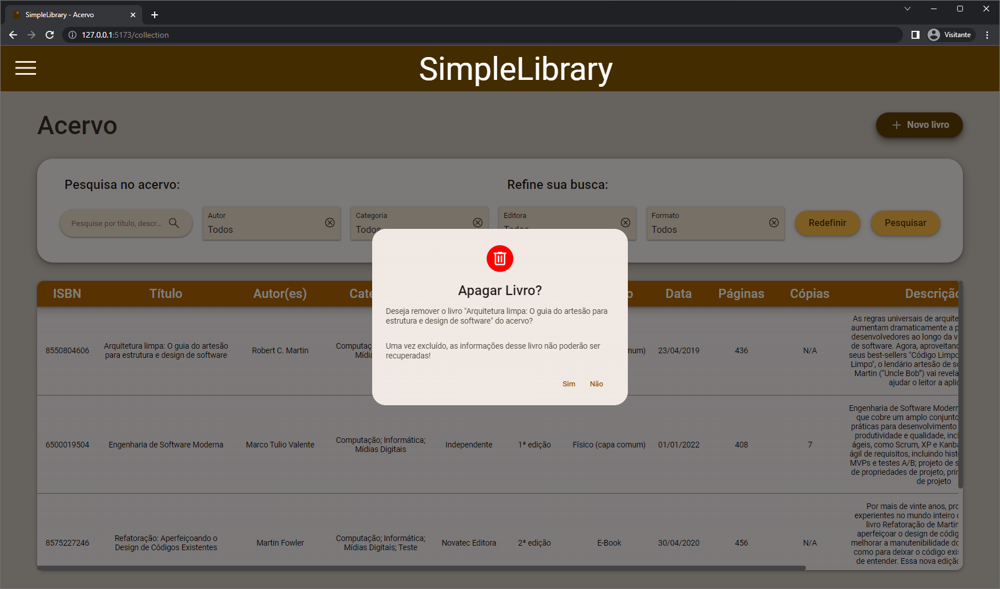
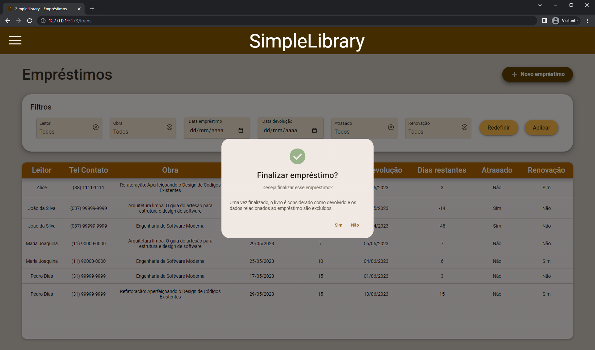
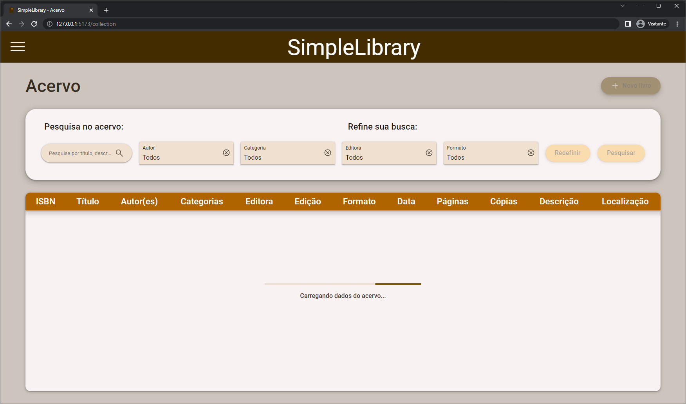

# SimpleLibrary (Frontend)

O **SimpleLibrary** é um sistema mínimo para gerenciamento de bibliotecas, que conta
com funcionalidades para gerenciamento do acervo de uma biblioteca e dos
empréstimos realizados por esta. O sistema apresenta uma interface simples,
baseada em tabelas, que permite ao usuário:

- Cadastrar informações sobre os livros do acervo (como título, autores, número
de cópias disponíveis, localização dos livros, etc.);
- Consultar as obras disponíveis no acervo;
- Atualizar e remover obras do acervo;
- Cadastrar empréstimos de livros informando: dados do leitor (como nome e
telefone), livro a ser emprestado, data de início e duração do empréstimo;
- Consultar os empréstimos em andamento, tendo acesso facilitado, por meio da
aplicação filtros, à informações como:
  - Todos os empréstimos cadastrados para uma determinada obra
  - Empréstimos realizados para um determinado leitor
  - Empréstimos feitos ou que vencem em uma determinada data
  - Empréstimos que estão atrasados
  - Empréstimos que são renovações (i.e., estendem o prazo de um empréstimo
    anterior);
- Atualizar informações de um empréstimo;
- Finalizar um empréstimo.

Este repositório contém apenas o código desenvolvido para as implementações do
*frontend* do sistema SimpleLibrary, que consistem em múltiplas implementações
de uma [Aplicação de Página
Única](https://pt.wikipedia.org/wiki/Aplicativo_de_p%C3%A1gina_%C3%BAnica)
(*Single Page Application* ou SPA), que diferem apenas pelo *framework*
utilizado para desenvolvê-las. O código relativo ao *backend*, que é comum a
todas as implementações do *frontend* e tem a forma de uma API REST que retorna
e processa documentos JSON (utilizados no processo de troca de informações entre
o *frontend* e o *backend*), está armazenado em um repositório dedicado, que
pode ser encontrado nesse
[link](https://github.com/PedroPires20/SimpleLibrary-Backend.git).

As funcionalidades descritas anteriormente são divididas em duas "páginas" —
i.e. duas telas mapeadas para duas pseudo-rotas —, sendo uma dedicada ao
gerenciamento do acervo e outra, ao gerenciamento dos empréstimos. Os elementos
gráficos que compõem essas telas e permitem ao usuário interagir com o sistema
são descritos na seção seguinte.

## Interface da aplicação

Ambas as "páginas" da aplicação apresentam os dados utilizando uma interface
simples, composta por uma tabela, que é posicionada no centro da página, abaixo
de uma caixa contendo componentes de entrada (como caixas de texto, seletores,
etc.) que permitem navegar pelos dados, fazendo buscas e/ou aplicando filtros. O
usuário alterna entre as páginas usando um menu lateral (*hamburger menu*),
acessível por meio de um ícone no cabeçalho (*header*) das páginas. Capturas de
tela da aplicação (feitas utilizando a implementação baseada em
[React](https://react.dev/)) exibindo a interface de apresentação dos dados do
acervo, dos empréstimos e o meu lateral podem ser vistas a seguir:

### 1. Tela do acervo

### 2. Tela dos empréstimos

### 3. Menu lateral

A criação/edição de livros e empréstimos, por sua vez, é feita utilizando um
formulário, contido em uma caixa de diálogo. Esse formulário é submetido para o
servidor do *backend* para realizar a operação desejada no sistema (i.e. a
criação ou edição de um livro/empréstimo). Esses diálogos podem ser vistos nas
capturas de tela a seguir:

### 4. Diálogo - Editar livro

### 5. Diálogo - Criar empréstimo

As opções para editar os dados dos livros e empréstimos, bem como a opção para
deletar um livro ou finalizar um empréstimo são acessadas por meio de um menu de
contexto, que é aberto ao clicar na linha da tabela correspondente ao
livro/empréstimo que deseja editar ou apagar/finalizar. Os menus em questão
aparecem abertos nas figuras abaixo:

### 6. Menu de contexto - Livro

### 7. Menu de contexto - Empréstimo

Por fim, ao deletar um livro ou finalizar um empréstimo, o usuário deve
confirmar sua ação. Para tanto, são exibidos os diálogos apresentados a seguir:

### 8. Diálogo confirmação - Apagar livro

### 9. Diálogo confirmação - Finalizar empréstimo

O sistema também conta com *feedback* visual para o processo de carregamento dos
dados e salvamento de alterações feitas no sistema. Eventuais erros nesses
processos também são apresentados de forma intuitiva, por meio de caixas de
diálogo ou mensagens de erro simples exibidas diretamente nas tabelas. A tela de
carregamento do acervo é apresentada na imagem abaixo:

### 10. Tela de carregamento - Acervo

## Arquitetura comum

Um detalhamento da arquitetura comum utilizada em todas as implementações do
*frontend* pode ser encontrado nesse [link](docs/arquitetura.md). O código fonte
que implementa os componentes dessa arquitetura e é compartilhado por todas as
implementações, por sua vez, pode ser acessado por meio desse
[link](common/README.md).

## Implementações

Como o objetivo deste trabalho é a análise comparativa da implementação de uma
mesma aplicação utilizando diferentes tecnologias para o desenvolvimento da
interface gráfica (*frontend*), três implementações do sistema
**SimpleLibrary** foram feitas, variando apenas o *framework* utilizado. Cada
implementação realizada está hospedada neste repositório, em um diretório
próprio. Detalhes específicos sobre a arquitetura e o processo de instalação e
execução para cada uma das implementações realizadas, bem como seus respectivos
o códigos fontes podem ser acessados mais facilmente utilizando os links
listados abaixo:

- [Implementação em React](React/README.md)
- [Implementação em Angular](Angular/README.md)
- [Implementação em Svelte](Svelte/README.md)
