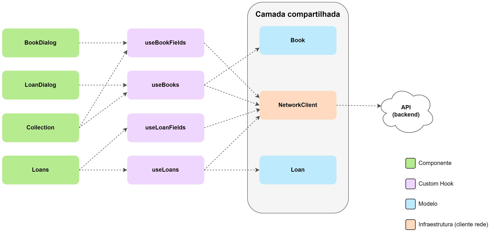

# Arquitetura (React)

A implementação do *frontend* feita em React, baseia-se ainda mais nas ideias
propostas por Juntao QIU no artigo [Modularizing React Applications with
Established UI
Patterns](https://martinfowler.com/articles/modularizing-react-apps.html) — que
também serve de base para a arquitetura "geral" (isto é, independente de
*framework*) do *frontend* —, uma vez que o foco desse artigo é justamente em
aplicações Web que utilizam o React como tecnologia para implementação de
interfaces do usuário. Partindo das camadas já estabelecidas na [arquitetura
comum](https://github.com/PedroPires20/SimpleLibrary-Frontend/docs/arquitetura.md)
do *frontend*, foram implementadas, utilizando os recursos fornecidos pelo
React, as camadas correspondentes à lógica da interface e às visualizações
(*views*).

## Visão geral

O diagrama a seguir apresenta uma visão geral da arquitetura da implementação em
React, incluindo os componentes suas camadas (denotadas pelas cores) e a relações
de dependência (representadas por setas):

A camada lógica (representada em roxo) é composta por [*custom
hooks*](https://react.dev/learn/reusing-logic-with-custom-hooks), um padrão de
programação do React que permite isolar a lógica do restante da implementação do
componente bem como compartilhar uma mesma lógica entre vários componentes.
Conforme definido anteriormente, essa camada tem os objetivos de realizar a
conexão entre as camadas "genéricas" (nominalmente, os modelos e o cliente de
rede) e o *framework* específico (nesse caso, o React) e também de implementar a
lógica "mais geral" da interface — envolvendo aspectos como o carregamento de
dados, tratamento de eventos de "mais alto nível" (como a submissão de um
formulário) e gerenciamento do estado global do *frontend*.

A camada das visualizações (representada em verde), por sua vez, é composta por
uma coleção de componentes do React que implementam diferentes partes da
interface que vão desde elementos mais simples (como botões, caixas de diálogo,
componentes de entrada para formulários, etc.) até a porções mais "complexas" da
interface, (como a tabela principal para a exibição dos dados, o conjunto de
entradas para navegação pelo acervo/empréstimos, formulários, etc.). Os
componentes do React são funções que retornam uma descrição da interface que
será apresentada (*markup*), que, ao final, gerará o código HTML a ser
apresentado pelo navegador Web. Essa "biblioteca" de componentes customizados e,
então, utilizada para compor as páginas principais da interface da aplicação
(isto é, a página para gerenciamento do acervo e a página para gerenciamento dos
empréstimos), que também são componentes React.

As camadas mencionadas anteriormente bem como algumas especificidades da
implementação do *frontend* baseada na biblioteca React serão exploradas com
detalhes nas seções seguintes.

## Camada lógica

Seguindo os padrões propostos no artigo de Juntao QIU, a camada lógica
implementada é composta de *custom hooks* que atuam como a fonte de dados do
*frontend* e como uma especie de *gateway* para as operações definidas pela
aplicação. Um *custom hook* foi implementado para cada entidade da aplicação, ou
seja, temos um *custom hook* associado aos livros (`useBooks`) e outro aos
empréstimos (`useLoans`). Além desses, também foram desenvolvidos *hooks* para
lidar com o carregamento de dados isolados de um campo dos livros/empréstimos.
Mais especificamente, foram implementados os *hooks* `useBookFields` e
`useLoanFields`, responsáveis por carregar e gerenciar os dados de todos os
valores únicos de alguns campos selecionados dos livros/empréstimos, como os
títulos de todos os livros no acervo ou o nome de todos os leitores com
empréstimos cadastrados no sistema. Esses dados são utilizados em alguns pontos
específicos da interface, como os seletores dos filtros e os formulários de
criação de empréstimos (que lista os livros disponíveis) e de livros (que lista
as categorias de livros já cadastradas).

Os *custom hooks* `useBooks` e `useLoans` possuem um estado interno — que se
traduz em uma chamada ao *hook* `useState`, disponibilizado pelo React para esse
fim —, responsável por manter os filtros atualmente aplicados pelo usuário aos
dados e, no caso do `useBooks`, a chave de busca (*query*) inserida pelo
usuário, se aplicável. Esses *hooks* retornam funções que permitem a seus
consumidores atualizar o estado dos filtros/*query* aplicada aos dados e possuem
um efeito colateral — implementado utilizando uma chamada do *hook* `useEffect`,
do React —, que é configurado para realizar uma chamada ao método responsável
por gerar uma requisição de carregamento dos dados dos livros/empréstimos para a
API (mais especificamente, os métodos `fetchBooks`, para os livros, e
`fetchLoans`, para os empréstimos) sempre que hover uma mudança nesse(s)
estado(s). Após o retorno da API, esses *hooks* atualizam um outro estado
interno, que reporta o estado do carregamento dos dados (em
progresso/finalizado) e eventuais erros, além de armazenar as instâncias dos
modelos correspondentes aos dados retornados, criadas pelo *hook* logo após o
recebimento de uma resposta de sucesso da API. Os valores desse estado também
são retornados ao chamador do *hook*. A rotina de carregamento também é ativada
(por padrão, pelo React), sempre que o *hook* é chamado pela primeira vez, de
modo que os dados de todos os livros/empréstimos são sempre carregados ao chamar
o *hook*, uma vez que os filtros/*query* padrão são nulos no estado inicial.

Além disso, esses *custom hooks* também implementam funções internas para tratar
as operações de criação, edição e remoção de livros/empréstimos, completando,
assim, as quatro operações básicas no desenvolvimento de uma aplicação (o
chamado CRUD, do inglês *Create Read Update Delete*). Essas funções recebem,
como parâmetro, os dados utilizados para a operação, que, no caso das criação e
edição, têm a forma de um objeto contendo os valores das entradas do formulário,
e, no caso da remoção, corresponde apenas ao identificador (ID) do
livro/empréstimo a ser apagado. Em ambos os casos, essas funções chamam o método
do cliente de rede correspondente à requisição da API necessária para executar a
operação desejada (`createBook/Loan`, para criação; `updateBook/Loan`, para
edição e `deleteBook/Loan`, para remoção) e retornam um objeto com uma
propriedade `error`, que tem um valor booliano indicando se ocorreu um erro na
operação e, em caso positivo, uma propriedade `errorMessage`, contendo a
mensagem de erro reportada. Para lidar com os dados vindos de formulários, essas
funções fazem uso dos métodos do modelo responsáveis por converter os dados para
o formato esperado pela API. As funções em questão também são responsáveis por
atualizar o estado interno do *hook* de acordo com a operação realizada —
mantendo-o consistente com o "estado" do *backend* — e são retornadas pelo
*hook* para que possam ser acessadas por seu chamador.

Por fim, os *custom hooks* `useBookFields`e `useLoanFields` operam de forma
análoga aos *hooks* `useBooks`e `useLoans`, detalhados anteriormente no que diz
respeito ao estado interno — que mantém, para cada campo considerado, seus
valores retornados pela API — e ao carregamento dos dados. A principal diferença
nesse processo está na forma como o carregamento dos dados (*fetch*) é acionado.
Para esses *hooks*, o processo é feito uma única vez, apenas no momento em que o
*hook* é chamado, não tendo, portanto, nenhuma dependência externa. Outra
diferença, está na ausência das demais operações do CRUD, que não são
necessárias nesse caso — o objetivo é apenas obter e manter todos os valores de
um determinado campo. A única exceção é o método `useBookFields`, que suporta a
adição de novas categorias por meio de uma função interna, que, porém, faz essa
alteração apenas no estado interno do *hook*, ficando a cargo de outra operação
(nesse caso, a criação de um novo livro), persistir as modificações no sistema.

Esses *hooks* mantêm uma variável de estado separada para cada campo que
armazenam/retornam e nem toda propriedade da entidade em questão
(livro/empréstimo) é considerada, sendo mantidas apenas aquelas cuja listagem
dos valores é utilizada diretamente pelo *frontend* da aplicação. No caso do
*hook* `useBookFields` são mantidos os valores dos campos: autores, categorias,
editoras e formatos, utilizados pelos seletores dos filtros e pelo formulário de
criação de novos livros. Já o *hook* `useLoanFields` mantém apenas as
informações relativas aos leitores e aos títulos dos livros emprestados, que são
as utilizadas diretamente pelos filtros nesse caso.

## Camada de visualizações

Os componentes implementados buscam ter o mínimo de lógica o possível, se
comportando, na maioria dos casos, como meros templates para geração de HTML a
partir de seus parâmetros, seguindo o princípio do isolamento da lógica do
restante da implementação defendido por Juntao QIU, em seu artigo. Boa parte da
lógica da interface da aplicação está concentrada nos *hooks* explorados
anteriormente, de modo que vários dos componentes implementados não possuem
estado próprio, sendo controlados por seus componentes-pai, por meio de
parâmetros ou servindo meramente como uma forma de modularizar a construção da
interface. Dentre os componentes que possuem alguma forma de gerenciamento de
estado e/ou efeito colateral interno, essas funcionalidades se limitam ao
gerenciamento de aspectos exclusivos do componentes (como abrir ou fechar a
lista de opções no seletor, por exemplo) e não estão diretamente relacionados ao
fluxo de dados da aplicação.

Quanto ao fluxo de dados propriamente dito, o React impõe o sistema de *one-way
data binding*, isto é, os dados fluem em apenas uma direção, dos componentes
mais altos na hierarquia para os componentes mais baixos. Tendo isso em mente,
as chamadas para os *custom hooks* contendo o estado geral da aplicação são
feitas em componentes de mais alto nível (no caso, as páginas) e os dados são
passados ao longo da hierarquia por meio de parâmetros (*props*) até chegaram ao
componente no qual serão utilizados. A única exceção é o componente
`LoanDialog`, que implementa o diálogo para criação/edição de empréstimos e
contém o formulário que realiza essas operações. Como esse componente precisa
acessar uma lista contendo os títulos e os IDs dos livros no acervo, é feita uma
chamada para o *hook* `useBooks`, de modo que essas informações são extraídas
das instâncias do modelo retornadas.
