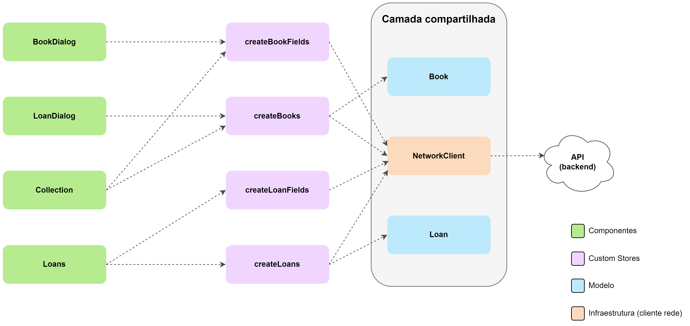

# Arquitetura (Svelte)

A implementação do *frontend* baseada em Svelte, assim como as demais, utiliza,
como base, a arquitetura proposta no artigo [Modularizing React Applications
with Established UI
Patterns](https://martinfowler.com/articles/modularizing-react-apps.html), mais
especificamente, o modelo *Layered Frontend Application*. Esse é o modelo que
foi utilizado como base para a arquitetura "comum" do *frontend* e que também
foi instanciado, com pequenas variações, nas demais implementações (baseadas em
React e Angular).

## Visão geral

O diagrama a seguir apresenta uma visão geral da arquitetura da implementação em
Svelte, incluindo os componentes, suas camadas (denotadas pelas cores) e a
relações de dependência (representadas por setas):

Assim como acontece com os demais *frameworks*, a arquitetura especifica da
implementação em Svelte também é dividida em duas principais camadas, sendo uma
delas a camada lógica (representada pelos módulos em roxo no diagrama),
responsável por realizar a conexão entre a camada comum, que é compartilhada com
as demais implementações, e o código específico do *framework*. Além desta,
temos a camada de visualizações, na qual os componentes, que formam os "blocos"
da interface, são implementados.

Na implementação em Svelte, a camada lógica é composta por
[*stores*](https://svelte.dev/docs/svelte-store), customizadas. Em Svelte, as
*stores* são objetos que seguem um contrato específico (cuja especificação pode
ser verificada neste
[link](https://svelte.dev/docs/svelte-components#script-4-prefix-stores-with-$-to-access-their-values)),
definindo alguns métodos que permitem ao *framework* interagir com este. Em sua
essência, as *stores* são objetos que representam variáveis reativas, isto é,
variáveis nas quais uma mudança de valor gera uma atualização da interface. As
*stores* funcionam como uma espécie de *proxy* para acessar uma variável
JavaScript qualquer e, nas versões disponibilizadas por padrão pelo Svelte,
podem ser de apenas leitura (*readable*), de leitura e escrita (*writable*) ou
derivados a partir de outros *stores* (*derived*). Além dessas, é possível
definir *stores* customizadas, o que permite incorporar lógica mais complexa a
esse "*proxy*" de acesso aos valores, além de possibilitar um maior controle
sobre a forma de sua atualização em relação aos stores padrão, que permitem
apenas atribuir um novo valor, no caso das *writable stores* ou não permitem
modificações externas, no caso das *readable stores*. Com *stores* customizadas
é possível encapsular os valores, porém ainda permitir modificações via métodos
específicos garantindo, por exemplo a aplicação de regras de negócio.

A camada de visualizações, por sua vez, é composta por componentes Svelte que
estão divididos em três "módulos", separados no código fonte por diretório. São
eles: o de componentes, que contém partes "menores" da interface, que são
reutilizadas em diversos locais desta; o de diálogos, que contém os componentes
responsáveis por implementar as caixas de diálogos exibidas em certos momentos
(como para a criação de novos livros ou exibição de mensagens de erro, por
exemplo) e, por fim, o de páginas, que define os componentes responsáveis por
renderizar as duas páginas da aplicação (isto é, a página dos livros e a dos
empréstimos).

Os componentes em Svelte são definidos em um tipo de arquivo especial, de
extensão `.svelte`, que utiliza uma sintaxe similar à da linguagem HTML e
contém, além da declaração da interface do componente (utilizando a linguagem
HTML propriamente dita), as definições de estilos (CSS) e lógica (código em
JavaScript) associadas ao componente. Esses arquivos são dados como entrada ao
compilador do Svelte que gera, como saída, código HTML e CSS "puro", além de
módulos JavaScript eficientes, responsáveis por lidar com a "reatividade" da
interface. Além da sintaxe HTML padrão, o Svelte adiciona uma sintaxe específica
para trabalhar o código HTML como template, suportando a renderização
condicional de certas partes da interface, *loops* e o uso de valores de
variáveis de forma reativa (isto é, valores que, quando modificados, causam uma
nova renderização da interface), como geralmente ocorre nos *frameworks
frontend*.

As camadas mencionadas anteriormente bem como os módulos que as compõem e
algumas especificidades da implementação do *frontend* baseada no *framework*
Svelte serão exploradas com detalhes nas seções seguintes.

## Camada lógica

Assim como nas demais implementações, a camada lógica na implementação em Svelte
também serve como a "fonte de dados" para o *frontend*, atuando como uma espécie
de "fachada" para as operações definidas pela aplicação e implementadas pela API
do *backend*. Essa camada é composta por quatro módulos que, além de algumas
funções auxiliares (utilizadas apenas internamente), definem e exportam as
funções responsáveis por retornar *stores* customizadas associadas às entidades
da aplicação (i.e. livros e empréstimos). Esses módulos são análogos aos *custom
hooks*, da implementação baseada em React, e aos serviços, utilizados pela
implementação feita em Angular.

As funções `createBookFields` e `createLoanFields` retornam uma *store* na forma
de um objeto JavaScript cujas chaves são os nomes dos campos associados aos
livros e empréstimos, respectivamente, e os valores são vetores contendo todos
os valores únicos registrados para o campo, na forma de strings. Cada valor é,
na verdade, uma *store* própria, permitindo que o chamador seja notificado de
modificações para apenas um dos campos de forma independente — isto é,
modificações em campos não utilizados por um componente não causarão novas
renderizações. Essas "*sub-stores*" têm comportamento de apenas leitura (i.e.,
funcionam como as *readable stores* padrão do Svelte), não podendo seus valores
serem modificados pelo chamador. A única exceção é a *store* associada aos
livros, que permite modificações nos valores do campo "categoria", a fim de
possibilitar que novas categorias sejam criadas pelo usuário em tempo de
execução. Para tanto, na chave associada às categorias no objeto retornado, além
do vetor de valores anteriormente mencionado, também é definido, no campo
associado às categorias, o método `appendCategory`, que recebe, como parâmetro,
uma string com o nome da nova categoria e atualiza os dados das categorias,
adicionando esse novo valor na posição final do vetor. Essas modificações,
porém, são apenas locais e, para que sejam persistidas, é necessário que seja
feita uma chamada à API por outros métodos, mais especificamente, pelo método
para a criação de livros, a fim de registar um novo livro associado à nova
categoria no banco de dados. Por fim, esses objetos também definem um método
para forçar uma atualização de seus valores (`refreshBookFields`, para os livros
e `refreshLoanFields`, para os empréstimos), que realizam uma nova chamada da
API.

As funções `createBooks` e `createLoans`, por sua vez, retornam as *stores* que
foram o cerne da aplicação. Essas *custom stores* têm a forma de um objeto
composto por duas propriedades e métodos correspondentes às operações
implementadas sobre essas entidades. Uma dessas propriedades é a `loadStatus`,
que funciona como uma "*sub-store* de apenas leitura à qual o chamador pode se
inscrever para obter informações sobre o estado de carregamento das informações
dos livros/empréstimos, que pode variar entre "carregado", "carregando" ou
"erro". Essas informações são utilizadas para prover *feedback* visual ao
usuário durante as chamadas da API que recuperam essas informações. O outro
campo (denominado `selectedBooks`, para os livros, e `selectedLoans`, para os
empréstimos), por sua vez, também funciona como uma *sub-store* e provê acesso a
um vetor contendo os livros/empréstimos atualmente selecionados de acordo com a
filtragem feita pelo usuário. Os livros/empréstimos são representados por
instâncias das classes de seus modelos definidas na camada comum, isto é, `Book`
e `Loan`, respectivamente. Diferentemente do status de carregamento, a
"*sub-store*" desse campo pode ser modificada externamente, porém apenas como um
efeito colateral dos métodos das operações disponibilizadas no objeto da custom
store.

Os métodos associados às *custom stores* retornadas por essas funções
correspondem, basicamente, às operações do CRUD, permitindo, portanto: recuperar
livros/empréstimos da base de dados; criar novos livros/empréstimos; atualizar
livros/empréstimos existentes e remover um livro/empréstimo. Para fazer uma
consulta sobre os livros registrados, é utilizado o método `queryBooks`, que
recebe, como parâmetro, uma string, correspondendo a uma consulta (textual) e um
objeto representando filtros, cujas chaves correspondem a propriedades dos
livros (como autor, editora, formato, etc.) e os valores representam os valores
a serem filtrados para esse campo. Essa função é responsável por comparar a
consulta e os filtros passados como parâmetros aos últimos filtros/consulta
feitos e, caso exista alguma diferença, realizar uma chamada para a API, a fim
de recuperar uma versão atualizada dos dados correspondente à nova busca. Esse
procedimento evita que uma nova chamada para a API seja feita sem necessidade e
torna o uso dessa função pelos clientes mais flexível — é possível, por exemplo,
fazer uma chamada para a função sempre que a página dos livros é carregada, sem
se preocupar com o custo da chamada à API, que só será realizada se realmente
for necessário (ou seja, se os dados não estiverem em memória). Por outro lado,
para os empréstimos, o método utilizado para recuperar os dados é o
`fetchLoans`, que funciona de forma análoga ao `queryBooks`, sendo a principal
diferença a ausência de um parâmetro de consulta, uma vez que, para os
empréstimos, apenas a filtragem é suportada, logo a função recebe apenas um
parâmetro que é o objeto representando o filtro a ser aplicado. Ambas as funções
atualizam, além do campo da *store* contendo os dados, o campo `loadStatus`, a
fim de reportar o *status* atual do carregamento dos itens e eventuais erros
encontrados.

Para a criação de livros/empréstimos, por sua vez, os métodos utilizados são
`createBook` e `createLoan`, respectivamente. Esses métodos recebem, como
parâmetro, um objeto contendo os dados do formulário de criação de novo
livro/empréstimo e, utilizando os modelos definidos na camada comum, convertem
esses dados para a representação interna e, na sequência, para o formato
utilizado pela API para as requisições. Esse objeto possui campos que
correspondem às entradas do formulário (e, consequentemente, aos dados
necessários para criar um livro/empréstimo) e são preenchidos por meio da
associação destes à propriedade `value` dos componentes do formulário,
utilizando o *two-way binding* fornecido pelo Svelte. Após essa conversão, é
disparada uma requisição para o *endpoint* associado à operação de criação de
novo livro/empréstimo. Essas funções retornam um objeto com os campos `error` e
`errorMessage`, em que `error` é um booliano que indica se ocorreu algum erro na
requisição e `errorMessage` é uma string contendo a mensagem de erro associada à
exceção encontrada (e só é preenchido caso algum erro ocorra).

Os métodos para a atualização de livros/empréstimos — `updateBook` e
`updateLoan`, respectivamente —, funcionam de forma análoga aos métodos de
criação de novos livros/empréstimos discutidos anteriormente, com o diferencial
de que esses métodos também recebem, como parâmetro, um inteiro identificando o
índice do livro/empréstimo a ser atualizado no vetor de itens atualmente
selecionados, que é armazenado pela *custom store*. Esse índice é determinando
no momento em que o usuário abre o menu de contexto com as opções de atualizar e
deletar um livro/empréstimo, clicando em uma das linhas da tabela exibida na
interface — esse evento de "clique na linha" é tratado como um evento
customizado que fornece o índice da linha clicada como parâmetro para a função
que o trata. O índice é, então, salvo como variável de estado da página e, na
sequência, é fornecido como parâmetro para a função que trata os eventos
customizados de atualização/remoção de livros/empréstimos. A partir do índice
recebido como parâmetro, esses métodos são capazes de determinar o identificador
único (ID) da entidade-alvo da atualização, acessando o objeto de modelo
armazenado no vetor da *custom store*. Esse ID é, então, fornecido como
parâmetro para a função do cliente de rede que dispara a requisição da API
responsável pela operação de atualização. Além disso, outro diferencial desses
métodos é o tratamento dado ao objeto contendo os dados do formulário. Após a
conversão desse objeto para a representação interna (i.e. instância da classe do
modelo), é feita uma chamada para um método abstrato, definido na classe
`Model`, que, dado outra instância da classe, retorna um objeto contendo apenas
os campos que se diferem entre essas duas instâncias e seu valor na instância
recebida como parâmetro. Esse método é chamado a partir da instância armazenada
no vetor de itens selecionados e seu resultado — que já está em formato
apropriado para uso nas requisições da API — é fornecido como um segundo
parâmetro ao método do cliente de rede que realiza a chamada da API e, após
receber uma resposta de sucesso, o livro/empréstimo do índice recebido é
substituído pela instância atualizada, gerada a partir dos dados do formulário.
Essas funções também retornam um objeto com os mesmos campos das funções de
criação de livros/empréstimos para indicar se ocorreu algum erro.

Por fim, os métodos para a remoção de livros/empréstimos — `deleteBook` e
`deleteLoan`, respectivamente —, são bastante similares aos métodos de
atualização, porém, como não é necessário preencher nenhum formulário para
realizar essa operação, apenas o índice do livro/empréstimo a ser apagado no
vetor de itens selecionados é recebido como parâmetro. A partir do índice, o ID
do livro/empréstimo é obtido da mesma forma que nos métodos de atualização e,
então, passado como parâmetro para o método do cliente de rede responsável por
disparar as requisições para apagamento de livros/empréstimos. Após receber uma
resposta de sucesso da API, o livro/empréstimo do índice recebido é apagado do
vetor de itens selecionados. Essa função também retorna um objeto para indicar a
ocorrência de erros, que segue o mesmo formato utilizado pelas funções
discutidas anteriormente.

## Camada de visualizações

Na implementação em Svelte os componentes também seguem o princípio de
isolamento da lógica do código das visualizações, defendido por Juntao QIU.
Utilizando a mesma divisão da interface em componentes e o mesmo
formato/comportamento destes, vários dos componentes implementados comportam-se
como um simples "templates HTML" que são preenchidos com valores passados como
parâmetro (propriedades) ou têm seu estilo e/ou comportamento alterado por
estes. Em alguns casos, os componentes implementados nem mesmo possuem
propriedades e servem apenas para encapsular estilos (CSS) usufruindo, para
tanto, das regras de escopo impostas pelo Svelte, que limitam a aplicação de
estilos apenas aos elementos do componente definido em um arquivo `.svelte`, de
forma similar ao que ocorre em Angular. Quanto à lógica da aplicação, temos que
a maior parte desta encontra-se contida nas *custom stores*, que implementam
todas as regras de negócio aplicadas no *frontend*. Apenas alguns componentes
com comportamento mais "complexo" (como as caixas de diálogo e seletores dos
formulários), possuem lógica e/ou estado próprios e, nesse caso, "misturar" a
lógica com o código das views no componente não representa um problema e é, na
verdade, até benéfico, dado que o código/estado relativo à lógica do componente
encontra-se encapsulado e associado ao restante do código do componente,
facilitando a manutenção.

O *framework* Svelte, assim como o Angular, suporta o *two-way data binding*,
permitindo que os dados fluam, por meio de propriedades "especiais", de um
componente pai para um componente filho e vice-versa. Esse recurso facilita a
implementação de certos aspectos da aplicação, em especial dos formulários, na
medida em que dispensa a definição (explicita) de *handlers* para eventos de
modificação de um valor e a passagem dessas funções como parâmetro (*callback*)
para o componente, como é feito em React. Utilizando-se do *two-way data
binding*, "preencher" um objeto com dados das entradas de um formulário torna-se
trivial, bastando-se associar as propriedades desse objeto à propriedade `value`
dos respectivos componentes de entrada do formulário, conforme mencionado
anteriormente. Por outro lado, diferentemente do Angular, não existe um sistema
de injeção de dependências e, consequentemente, os módulos da camada lógica têm
a forma de funções, similares aos *hooks* da implementação em React, que criam
um contexto próprio a cada chamada (comportando-se como variáveis locais),
enquanto, em Angular, o contexto é global e pode ser alterado conforme a
necessidade. Isso, porém, não representa um problema, dado que as chamadas para
as *custom stores* (que representam os módulos da camada lógica) podem ficar
contidas nos componentes de mais alto nível, sendo os dados/funções transmitidos
via propriedades ou API de contextos, conforme a necessidade e a "profundidade"
do componente que precisa de acesso à *custom store*.
