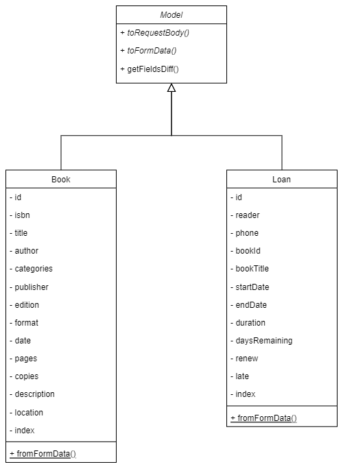

# Arquitetura comum

Fortemente baseada nas ideias propostas por Juntao QIU no artigo "Modularizing
React Applications with Established UI Patterns" (que pode ser acessado neste
[link](https://martinfowler.com/articles/modularizing-react-apps.html)), a
arquitetura escolhida para o *frontend* dessa aplicação foi desenvolvida de
forma a maximizar a reutilização de código entre as diferentes implementações.
Mais especificamente, o modelo *Layered frontend application* (aplicação
*frontend* em camadas), proposto nesse artigo, foi tomado como inspiração
juntamente à já bem estabelecida arquitetura
[MVC](https://developer.mozilla.org/en-US/docs/Glossary/MVC) (do inglês, *Model
View Controller*, significando modelo, visualização e controle,
respectivamente), a arquitetura proposta implementa, no *backend*, os modelos e
controladores associados às entidades com as quais a aplicação lida —
nominalmente: livros e empréstimos —, contendo, portanto, a maior parte da
lógica da aplicação (em uma abordagem conhecida como *thin-client*). As, views
por sua vez, são implementadas no *frontend*.

Porém, devido à divisão mais forte entre *frontend* e *backend* que é imposta
pela necessidade de comunicação em rede (via API REST), algumas modificações
foram feitas em relação ao modelo MVC original. Ainda tomando por base o
princípio de separação de responsabilidades e a separação da aplicação em
camadas, as implementações do *frontend* seguem uma arquitetura que, além da
camada de visualização, conta com: uma camada dedicada à lógica de comunicação
em rede; uma camada de modelos (diferente da do *backend*), dedicada ao
processamento dos dados recebidos da API e sua respectiva formatação, para que
possam ser exibidos diretamente pelas *views* e, por fim, uma camada para
implementação da lógica da interface, que varia de acordo com as ferramentas
disponibilizadas pelo *framework* utilizado e com os padrões impostos por este,
mas que, via de regra, é responsável por responder a eventos da interface,
modificando os modelos e gerando requisições para a API conforme necessário e
mapear os dados vindo dos modelos para as visualizações, bem como as entradas do
usuário para o formato exigido pela API para as requisições. As camadas
descritas anteriormente e as relações entre elas podem ser visualizadas no
diagrama abaixo:

A estrutura das camadas lógica e de visualização, por sua vez, depende
completamente do *framework* utilizado e será detalhada separadamente para cada
implementação. As classes que compõem as demais camadas, compreendendo o cliente
de rede e os modelos, serão detalhadas na sequência.

## Cliente de rede

O cliente de rede foi implementado como uma única classe, embora outras outras
duas classes, que consistem apenas em exceções customizadas, tenham sido
implementadas, com o objetivo de facilitar o processo de tratamento de erros na
aplicação, bem como a apresentação desses erros para o usuário. O diagrama UML
correspondente a essa camada pode ser visto abaixo.

Os métodos implementados na classe `NetworkClient` correspondem às operações
disponibilizadas pela API e, consequentemente a um *endpoint* desta. Esses
métodos recebem, como parâmetro, as informações necessárias para realizar a
requisição (quando aplicável) e, internamente, as mapeiam para parâmetros GET ou
para um documento JSON (i.e. o corpo da requisição), a depender do tipo de
requisição realizada. Caso a requisição seja processada com sucesso, esses
métodos retornam objetos JavaScript correspondentes ao documento JSON recebido
como resposta e, em caso de erro, uma das exceções customizadas é levantada —
mais especificamente, a exceção `NetworkError`, em caso de erro de comunicação
com o servidor e `HTTPError`, caso uma resposta de erro seja recebida do
servidor.

## Modelos

Os modelos, por sua vez, herdam de uma classe abstrata `Model`, que implementa o
método `getFieldsDiff(targetObject)`, responsável por retornar um objeto
contendo todos os campos (propriedades) de um objeto-alvo que diferem do objeto
atual (instância da classe) com seus valores no objeto-alvo. Esse método é
utilizado para atualizar os dados de forma mais eficiente quando o usuário
realiza modificações no modelo. Os métodos abstratos `toRequestBody()` e
`toFormData()` são responsáveis por retornar objetos contendo os dados da
instância atual no formato esperado pelas requisições da API e pelos formulários
HTML, respectivamente. Cada modelo (i.e. classe concreta que herda a classe
`Model`) também implementa um método estático `fromFormData()`, que retorna uma
instância do modelo obtida a partir de um objeto de entrada que contém os dados
no formato gerado pelos componentes de entrada dos formulários HTML. O diagrama
UML correspondente à hierarquia de classe dos modelos do *frontend* pode ser
visto a seguir:

A partir das funcionalidades implementadas pelos modelos, é possível realizar
todas as operações de conversão de dados para os diferentes formatos com os
quais a aplicação lida — nominalmente: o formato no qual os dados são
gerados/modificados pelos formulários HTML; o formato imposto pela API (i.e. a
estrutura do JSON utilizado como entrada para as operações) e o formato de
exibição na interface. Em sua maior parte, as classes (concretas) de modelos do
*frontend* se comportam como uma espécie de *data class*, armazenando os dados
relativos à entidade que representa em um formato estruturado. As regras
de formatação dos dados para a exibição no frontend, como tratamento de valores
nulos, conversões de tipo, formatação de datas, etc., são implementadas por meio
de *getters*, associados a cada um dos campos do objeto, que podem apenas
retornar o valor do campo ou aplicar alguma das regras mencionadas
anteriormente. Os *getters* são implementados utilizando a sintaxe `get` da
linguagem JavaScript, que permite acessá-los como se fossem propriedades,
tornando o acesso aos dados nas views mais conveniente e melhorando a
legibilidade do código.
